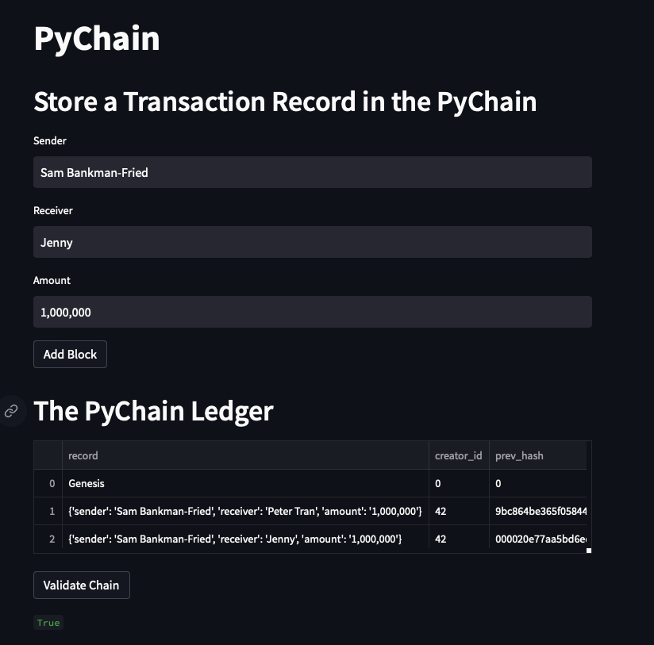
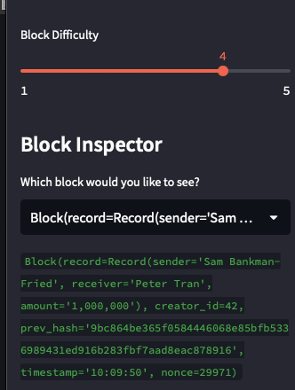

# PyChain Ledger

You’re a fintech engineer who’s working at one of the five largest banks in the world. You were recently promoted to act as the lead developer on their decentralized finance team. Your task is to build a blockchain-based ledger system, complete with a user-friendly web interface. This ledger should allow partner banks to conduct financial transactions (that is, to transfer money between senders and receivers) and to verify the integrity of the data in the ledger.

---

## Project Requirements

To run the PyChain Ledger application, you need to have the following:

- Python 3.7
- Streamlit framework
- Panads Library
- Date Classes
- Typing
- Hashlib

---

## Project Structure

- 'pychain.py' contains the main code for the PyChain ledger implementation.
- 'README.md' provides an overview of the project, its requirements, and how to run the application.
- 'Images' directory contains screenshots of the application's interface for reference.

---

## Using the PyChain Ledger Application

In the PyChain Ledger application, Streamlit is used to create the web interface that allows users to interact with the blockchain. The interface includes input areas for the sender, receiver, and amount values, as well as buttons to add blocks to the blockchain and validate the chain

To use the PyChain Ledger application, follow these steps:

1. Clone the repository to your local machine.

2. Navigate to the project directory and install the required libraries by running the following command:

`pip install streamlit`

3. Run the application by running the following command:

`streamlit run pychain.py`

4. The PyChain Ledger application will open in your default web browser. Enter the sender, receiver, and amount values, and then click the "Add Block" button to add the transaction to the blockchain. The block details, including the hash, will appear on the screen.

5. To validate the blockchain, click the "Validate Chain" button. A message will appear indicating whether the blockchain is valid or not.

## Additional Information

- The difficulty level of the proof-of-work algorithm can be adjusted using the slider in the sidebar. A higher difficulty level means more computational power is required to mine a block, making the blockchain more secure.

- The sidebar also includes a block inspector, which allows you to view the details of any block in the chain by selecting it from the dropdown menu.

---

## Project Details

The steps for this assignment are divided into the following sections:

1. Create a Record Data Class

2. Modify the Existing Block Data Class to Store Record Data

3. Add Relevant User Inputs to the Streamlit Interface

4. Test the PyChain Ledger by Storing Records

### Step 1: Create a Record Data Class

Define a new Python data class named `Record`. Give this new class a formalized data structure that consists of the `sender`, `receiver`, and `amount` attributes.

### Step 2: Modify the Existing Block Data Class to Store Record Data

Rename the `data` attribute in your `Block` class to `record`, and then set it to use an instance of the new `Record` class that you created in the previous section.

### Step 3: Add Relevant User Inputs to the Streamlit Interface

Code additional input areas for the user interface of your Streamlit application. Create these input areas to capture the sender, receiver, and amount for each transaction that you’ll store in the `Block` record.

### Step 4: Test the PyChain Ledger by Storing Records

Test your complete `PyChain` ledger and user interface by running your Streamlit application and storing some mined blocks in your `PyChain` ledger. Then test the blockchain validation process by using your `PyChain` ledger.
